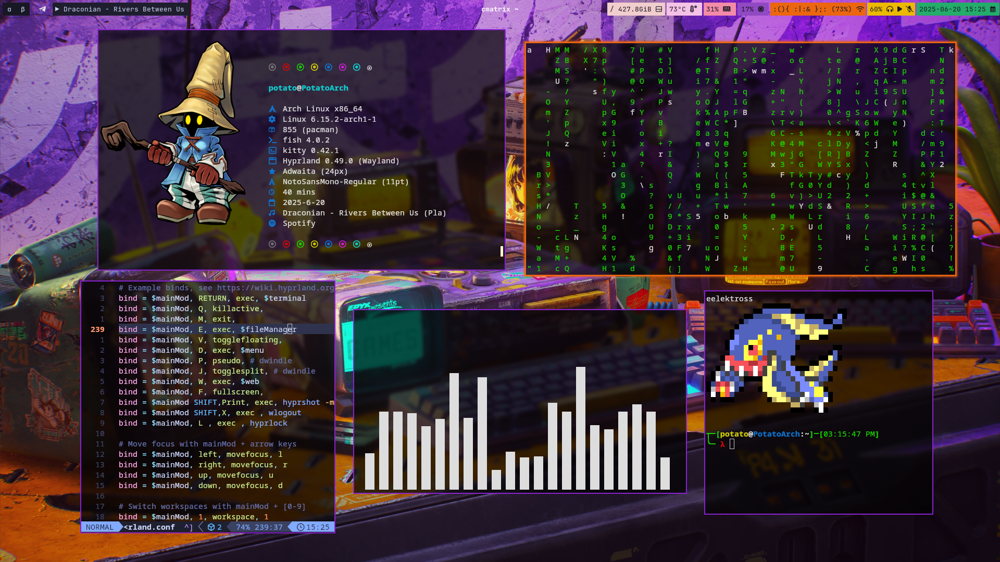
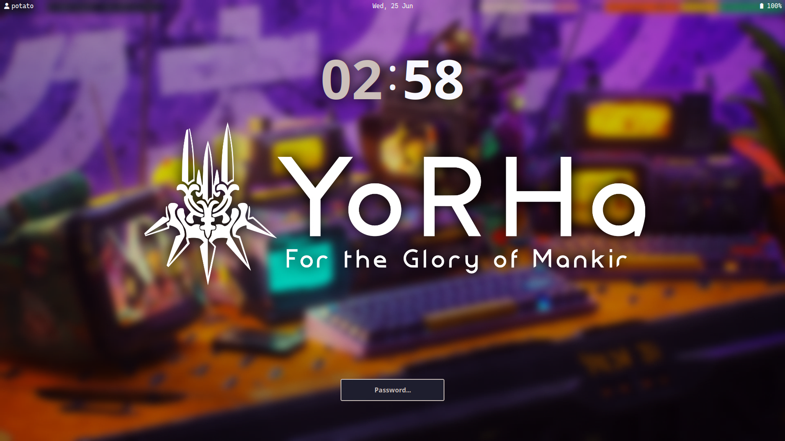
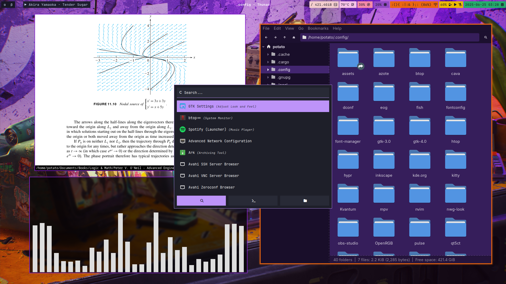
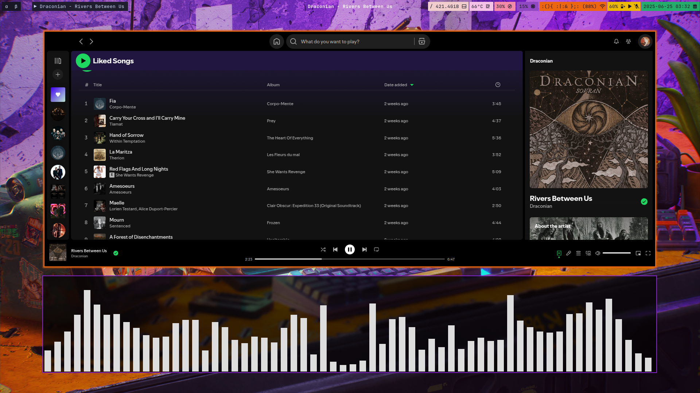
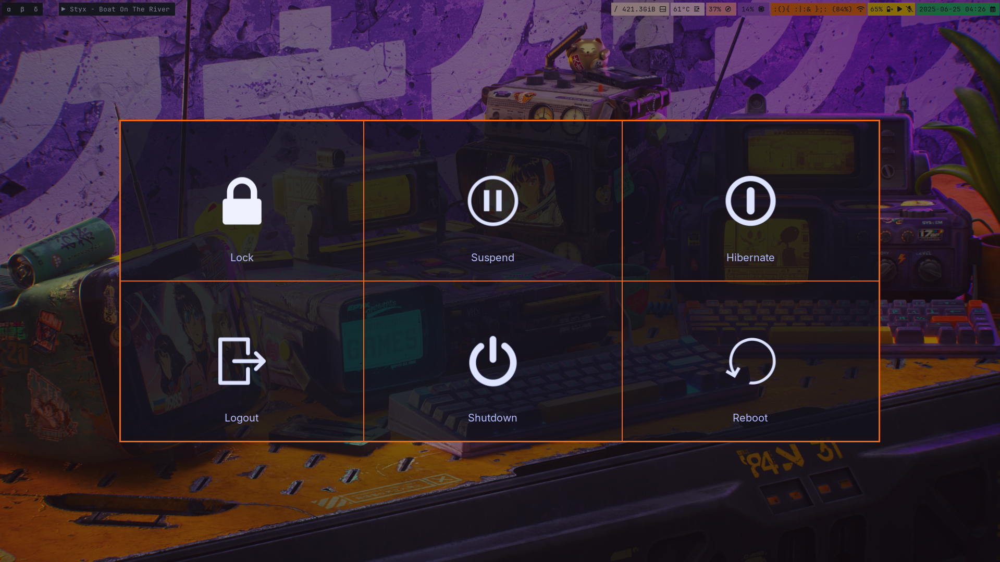

# stolen-dotfiles
Stay away from my dotfiles!


|package        |     |
| ------------- |-----|
|[Hyprland](https://github.com/hyprwm/Hyprland)|Window Manager|
|[Rofi](https://github.com/hyprwm/Hyprland)|Application launcher|
|[Kitty](https://github.com/kovidgoyal/kitty)|Terminal|
|[Waybar](https://github.com/Alexays/Waybar)|Wayland bar|
|[Neovim](https://github.com/neovim/neovim) |Text Editor|
|[Cava](https://github.com/karlstav/cava)   |Audio Visualizer|
|[Fastfetch](https://github.com/fastfetch-cli/fastfetch) |System Information|
|[SDDM](https://github.com/sddm/sddm) |Display Manager|
|[Hyprlock](https://github.com/hyprwm/hyprlock)|Screen Lock|
|[Wlogout](https://github.com/ArtsyMacaw/wlogout)|Logout Menu|
|[Shades-of-purple-standard-buttons](https://www.gnome-look.org/p/2074105)|GTK Theme|
|[Zathura](https://github.com/pwmt/zathura)|Document Viewer|

# Screenshots
|Preview                                              |
|-----------------------------------------------------|
||
## More Screenshots :
<details>
  </img>
  </img>
  </img>
  </img>
</details>

# Pokemon Terminal Pixel Art
Original GitLab Repo : [pokemon-colorscripts](https://gitlab.com/phoneybadger/pokemon-colorscripts)

<p align="center">
  </img>
</p>

#### Installation :

```fish
paru -S pokemon-colorscripts-git
```

or by using `yay` : 

```fish
yay -S pokemon-colorscripts-git
```
If you are in `fish` shell then add this command to `fish_greeting` in `fish/config.fish` :

```fish
function fish_greeting
    pokemon-colorscripts -r
end
```
# Hyprland Keybinds : 

|Key|Function|
|--|---------|
|`Super+W`|Open Firefox|
|`Super+Ret`|Open Terminal|
|`Super+Q`|Close Window|
|`Super+W`|Exit Hyprland|
|`Super+F`|Fullscreen|
|`Super+Shift+Print`|hypershot|
|`Super+Shift+X`|Wlogout|
|`Super+L`|Hyprlock|
|`Super+E`|File Manager|
|`Super+D`|Rofi|

